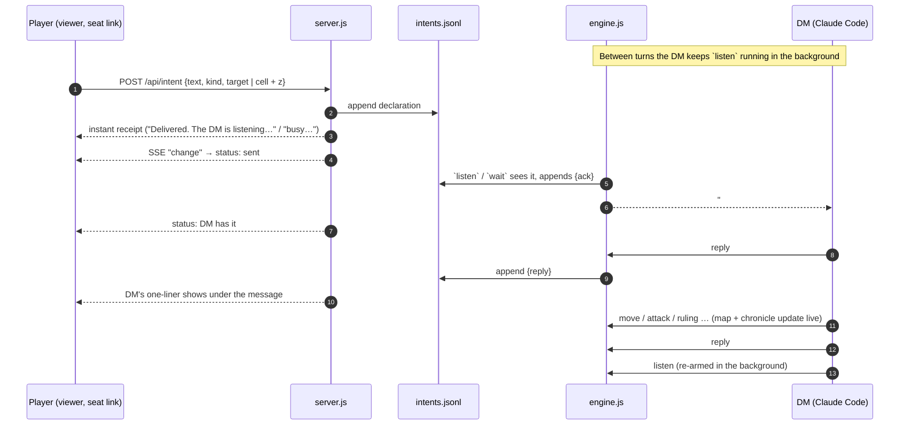

# How a player's words reach the DM (and back)

Remote players type into the viewer; the DM (Claude Code) only learns about it by running an
engine command. Everything below exists to shrink the gap between "player hits Send" and "player
knows the DM is on it".

If the DM is in the middle of something else (no `listen` running), the message still isn't
lost: **every engine command** ends with `📨 N unread from sam: run "intents" and reply.`
until the DM takes it, so it surfaces on the DM's very next move. The player's receipt says
which of the two cases they're in, and the "DM listening / DM busy" light in the viewer shows
it continuously (the engine touches `listening.json` while `listen` or `wait` is blocking).

## Message states (what the player sees)

| State | Means | Set by |
|---|---|---|
| `sent 12s ago` + receipt | landed on the server | `server.js` on POST |
| `DM has it · 3s ago` | the DM's engine read it | `listen`, `wait`, `intents` (or a `reply`) |
| `answered` + DM line | the DM said how they're resolving it | `reply <#id\|player> "…"` |
| `done ✓` | resolved | `reply … --done` |

## The cursor (pointing and inspecting)

* **Square mode** points at a square, with a height (the `−`/`+` buttons, the box, or `[` `]`).
  **Entity mode** points at a creature. `M` switches, arrows move, `Esc` clears.
* The panel shows what *your character* can tell, from `C.look()`: health as a description,
  conditions, footing, distance (height included), line of sight, cover, which of your attacks
  reach, how much movement it takes to get to a square, and any facts the DM has recorded with
  `describe`. Hidden creatures and unexplored squares return nothing.
* Whatever you're pointing at rides along with your next action (`target`, or `cell` + `z`), so
  "I shoot *that*" is unambiguous.
* **Ask** sends an `inspect` question (private: it stays out of the chronicle). The DM decides
  what the character would know, rolls if it's uncertain, and answers with `reply`; lasting
  discoveries go in with `describe <id|cell> "…"` so they show on everyone's inspect card.
* **Ping** (`P`) flashes the spot, with your name, on every connected map. Pings are not stored.

## Turn buttons (no DM needed)

On a player's own turn, the viewer shows a tracker (action / bonus / reaction pips, movement
left) and buttons. Each one is an ordinary engine command run by `server.js` for the creature
whose turn it is, one at a time:

| Button | Engine command | Wakes the DM? |
|---|---|---|
| Move here (route previewed on hover, jump / climb-fast toggles) | `move` | only if it rolled Athletics, fell, or provoked |
| Dash / Disengage (bonus variants with Cunning Action, Nimble Escape) | `dash` / `disengage [--as bonus]` | no |
| Dodge | `dodge` | no |
| Undo move (plain moves, before acting) | `undo` | no |
| Hide | `use` + `check stealth` | yes: the DM compares the total |
| Attack (on the inspect card, with Sneak Attack when it applies) | `attack [--sneak]` | yes |
| Roll check (skill picker on the inspect card) | `check <skill>` | yes |
| End turn | `next` | yes |

Each result is filed in `intents.jsonl` as an `auto` entry. Quiet ones pile up; the next loud
one wakes `listen`/`wait`, and the DM gets the whole pile as one package.

**Offers** go the other way: `offer <player> "terms" --skill … --dc …` pops a dialog for the
player with the DC their character could judge. "Roll it" makes the roll on the spot and wakes
the DM with the result; "Never mind" just tells the DM.

**Dice and hits:** every attack, check, save, ruling, damage and heal in the log carries its
numbers in `data`, and the viewer plays them: the d20 lands, the shot flies (or the attacker
lunges), the target flashes and the damage rises off it. Projectile looks are keyed by damage
type in `SHOT_LOOK` (3D) and `shoot2d` (2D), ready to grow.

## Endpoints

| Route | Who | What |
|---|---|---|
| `POST /api/intent` | seat | declare an action / ask a question; returns a receipt |
| `GET /api/seat` | seat | your recent messages with status + replies, and DM presence |
| `GET /api/look` | anyone (seat: through your own characters) | the inspect card |
| `POST /api/ping` | seat, or this machine | broadcast a ping over SSE |
| `GET /api/path` | seat, on their turn | route preview: path, cost, DCs on the way, opportunity attacks |
| `POST /api/act` | seat, on their turn (answers: any time) | run a turn button, or answer an offer |

The person at the DM's machine counts as the seat `local` for any player-controlled creature
without a remote player, so the same buttons work there.
